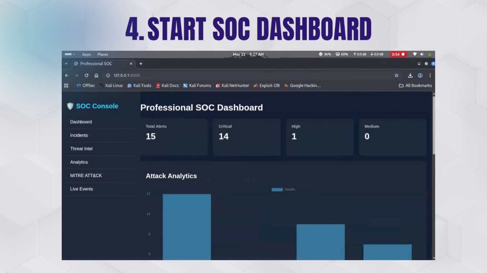
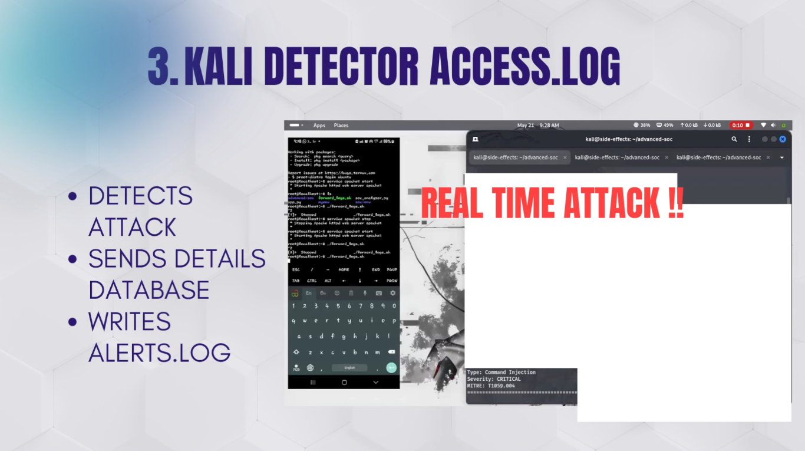
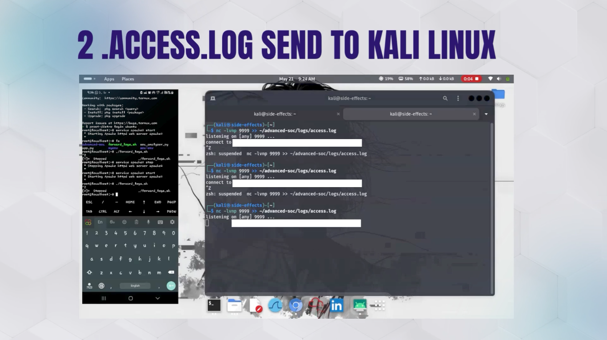

# 🛡️ Advanced SOC Analyst Dashboard

<div align="center">


### 🚨 Real-Time Threat Detection & SOC Monitoring Platform

A Python-based Security Operations Center (SOC) monitoring platform that performs real-time log analysis, threat detection, MITRE ATT&CK mapping, and security event visualization using Flask and SQLite.

</div>

---

# 📸 Live Demo

<div align="center">

## 🎥 SOC Dashboard Demo

> Replace the GIF below with your own demo GIF.


</div>

---

# 🚀 Features

✅ Real-time Apache log monitoring
✅ SQL Injection detection
✅ XSS attack detection
✅ Command Injection analysis
✅ Directory Traversal detection
✅ MITRE ATT&CK mapping
✅ Severity classification
✅ Flask-powered SOC dashboard
✅ SQLite incident storage
✅ Multi-machine SOC architecture

---

# 🧠 Technologies Used

| Technology  | Purpose                    |
| ----------- | -------------------------- |
| Python      | Backend & Detection Engine |
| Flask       | SOC Dashboard              |
| SQLite      | Incident Storage           |
| Apache2     | Log Generation             |
| HTML/CSS/JS | Frontend Interface         |
| Linux       | Security Environment       |
| Kali Linux  | SOC Analysis Machine       |
| Termux      | Target Web Server          |

---

# 🏗️ SOC Architecture

```text
[Termux Apache Server]
        ↓
[Apache Access Logs]
        ↓
[detector.py Threat Engine]
        ↓
[SQLite Database]
        ↓
[Flask SOC Dashboard]
```

---

# 📂 Project Structure

```text
advanced-soc/
│
├── app.py
├── detector.py
├── requirements.txt
├── README.md
├── .gitignore
│
├── database/
│   └── soc.db
│
├── logs/
│   └── access.log
│
├── templates/
│   └── dashboard.html
│
├── static/
│   ├── style.css
│   └── app.js
│
├── screenshots/
│   ├── dashboard.png
│   ├── detector.png
│   └── alerts.png
│
└── demo/
    ├── soc-demo.mp4
    └── soc-demo.gif
```

---

# 🔥 Supported Threat Detection

| Threat Type         | Severity | MITRE ATT&CK |
| ------------------- | -------- | ------------ |
| SQL Injection       | HIGH     | T1190        |
| XSS Attack          | MEDIUM   | T1059        |
| Command Injection   | CRITICAL | T1059.004    |
| Directory Traversal | CRITICAL | T1083        |

---

# ▶️ Running the Project

## 1️⃣ Clone Repository

```bash
git clone https://github.com/YOUR_USERNAME/advanced-soc-dashboard.git
cd advanced-soc-dashboard
```

---

## 2️⃣ Install Requirements

```bash
pip install -r requirements.txt
```

---

## 3️⃣ Start Detector Engine

```bash
python detector.py
```

---

## 4️⃣ Start Dashboard

```bash
python app.py
```

---

## 5️⃣ Open Dashboard

```text
http://localhost:5000
```

---

# 📸 Screenshots

## 🖥️ SOC Dashboard



---

## 🚨 Threat Detection Engine



---

## 📊 Security Alerts



---

# 🎥 Creating Demo GIF from Video

## Install FFmpeg

```bash
sudo apt install ffmpeg -y
```

---

```text
demo/soc-demo.gif
```


# 💼 LinkedIn Project Title

> Advanced SOC Analyst Dashboard with Real-Time Threat Detection

---

# 👨‍💻 Author

Your Name
Cybersecurity Enthusiast | SOC Analyst | Python Developer

---

# ⭐ Future Improvements

* Real-time WebSocket updates
* AI-based threat scoring
* Elasticsearch integration
* Threat intelligence feeds
* Advanced SIEM correlation rules
* User authentication
* PDF incident reporting

---

<div align="center">

### 🛡️ Developed for SOC Analysis, Threat Monitoring & Detection Engineering

</div>
